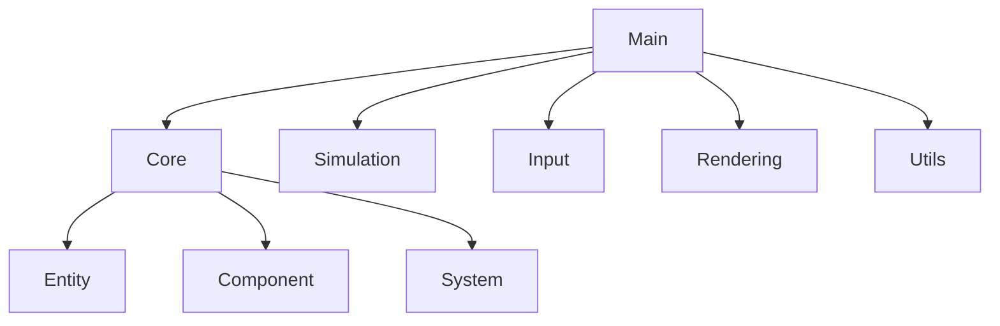

# Vessel simulator draft

ECS design pattern is used for the simulation. The ECS (Entity-Component-System) pattern is a software architectural pattern that is commonly used in game development and simulations. It separates data (components) from behavior (systems), allowing for more flexible and reusable code. In this case, the ECS pattern is used to manage the entities (ships, in this case) and their components (position, velocity, etc.) in the simulation.

The ECS pattern consists of three main parts:

- Entity-Component-System (ECS): A design pattern that separates data and behavior in a simulation.
- Entity: A unique identifier for an object in the simulation. In this case, it represents a ship.
- Component: A data structure that holds information about an entity. In this case, it represents the position, velocity, and other properties of a ship.
- System: A piece of code that operates on entities with specific components. In this case, it updates the position of ships based on their velocity.

## Vessel Simulator

